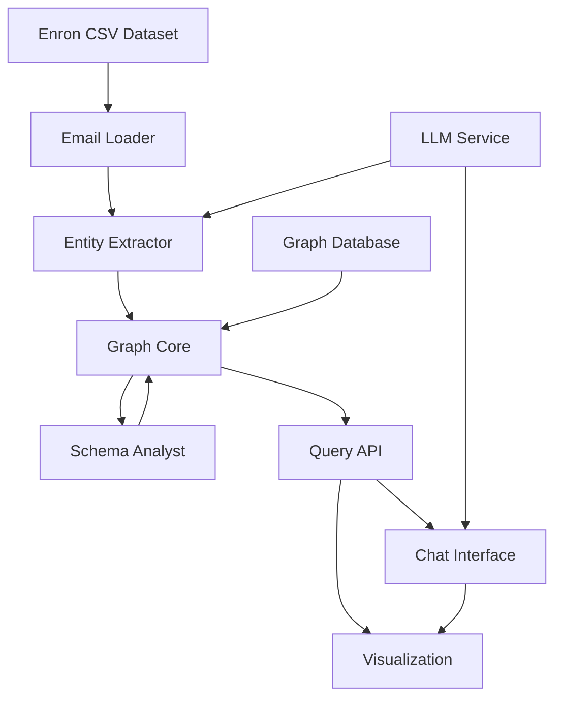

# Technical Analysis: Cognitive Backbone POC

**Feature**: 001-cognitive-backbone-poc  
**Analysis Date**: 2026-01-24  
**Analyst**: GitHub Copilot  

## Executive Technical Summary

This POC requires building a multi-component system with four core capabilities:
1. **Graph Storage & Query Engine** - Persistent graph database with schema evolution support
2. **Email Loader** - CSV parser for Enron email dataset with batch processing
3. **Entity Extractor** - LLM-powered entity and relationship extraction with confidence scoring
4. **Schema Analyst** - Pattern detection and type promotion engine with audit logging
5. **Query Interface** - API layer with optional visualization and natural language chat

The primary technical challenges are: (1) maintaining dual entity states (discovered vs promoted), (2) implementing schema evolution without data migration, (3) achieving extraction accuracy with LLMs, and (4) query performance at scale.

## Component Breakdown

### 1. Core Graph Engine (FR-001 to FR-006)

**Responsibilities**:
- Persist nodes (entities) and edges (relationships) with arbitrary properties
- Support property-based queries (exact, partial, range)
- Traverse relationships (1-hop, n-hop, shortest path)
- Store and index vector embeddings for entities and content
- Support semantic similarity search using vector embeddings
- Manage schema definitions for promoted entity types
- Enable schema evolution without data migration
- Maintain separation between discovered and promoted entities

**Technical Considerations**:

**Graph Database Selection**:
- **Selected**: PostgreSQL + ent (Go ORM) + pgvector extension
- **Rationale**:
  - Unified storage for graph data and vector embeddings via pgvector
  - ent provides graph-like abstractions (entities, edges) with flexible schema support
  - Supports dual entity states (discovered/promoted) through ent's schema definition
  - HNSW indexing in pgvector for fast vector similarity search
  - Single database simplifies deployment and data consistency
  - Open source with permissive license (PostgreSQL License)
  - Atlas Go can be used for advanced schema migrations if needed

**Vector Embedding Strategy** [DESIGN DECISION REQUIRED]:
- **Storage Options**:
  - **PostgreSQL + pgvector**: Store embeddings as vector columns, use cosine similarity/L2 distance for search
    - Pros: Unified storage (graph + vectors), mature extension, HNSW index support
    - Cons: PostgreSQL not native graph DB (using ent for graph abstraction)
  - **Dedicated Vector DB + Graph DB**: Separate Qdrant/Weaviate for vectors, sync with graph
    - Pros: Optimized vector search, specialized features
    - Cons: Data synchronization complexity, two systems to maintain
  - **Hybrid in ent**: Store embedding vectors as JSONB/bytea in PostgreSQL, implement similarity search in application
    - Pros: Simple architecture, single database
    - Cons: Slower similarity search without native vector indexes
- **Recommendation**: PostgreSQL + pgvector extension (aligns with ent/PostgreSQL choice, unified storage)

**Embedding Use Cases**:
- **Entity Similarity**: Find similar entities based on content (e.g., similar people by email content patterns)
- **Semantic Search**: Natural language queries → find entities with similar meaning ("energy trading" matches "power markets")
- **Entity Deduplication**: Use embedding similarity to identify potential duplicates ("John Smith" vs "J. Smith")
- **Topic Clustering**: Group discovered entities by embedding similarity for schema analyst

**Embedding Generation**:
- **When**: During entity extraction (FR-012-017), generate embeddings for entity names, descriptions, email content
- **Model**: Local Ollama model (mxbai-embed-large or nomic-embed-text) with fallback to LiteLLM for API-based models (OpenAI text-embedding-3-small)
- **Dimensions**: 768-1024 (local models) or 1536 (OpenAI via LiteLLM)
- **Storage**: Store as vector column in entity table (PostgreSQL vector type)
- **Indexing**: Create HNSW or IVFFlat index for fast similarity search

**Query Performance**:
- Similarity search target: <500ms for top-K queries (K=10-50) on 100k entities
- Requires proper vector indexing (HNSW recommended for recall/speed balance)
  
**Schema Evolution Strategy**:
- **Approach**: Ent-based schema with code generation for promoted types
  - **Discovered Entities**: Store in flexible `DiscoveredEntity` table with JSONB properties field
  - **Promoted Entities**: Define new ent schema (Go struct) which generates dedicated table via migration
  - **Promotion Process**: 
    1. Analyst identifies candidate type
    2. Generate new ent schema definition (e.g., `Person`, `Organization`)
    3. Run `ent generate` to create Go code
    4. Run `atlas migrate` or `ent migrate` to create database table
    5. Migrate data from `DiscoveredEntity` to new typed table
  - **Benefits**: Type safety in Go, database-level constraints, migration tracking via Atlas
  - **Migration-aware**: Atlas tracks all schema changes, enables rollback if needed

**Query Performance Requirements**:
- Entity lookup by property: <500ms for 100k nodes (SC-003)
- Shortest path: <2s for 6 degrees of separation (SC-004)
- Vector similarity search: <500ms for top-50 results on 100k entities
- Implies need for: Property indexing, relationship indexing, vector indexing (HNSW/IVFFlat), query optimization

**API Design**:
- REST vs GraphQL vs native graph query endpoint
- Authentication/authorization (probably skip for POC per constraints)
- Result pagination for large query results
- Error handling for disconnected paths, missing entities

---

### 2. Email Loader (FR-007 to FR-011)

**Responsibilities**:
- Parse Enron email CSV files
- Extract metadata: sender, recipients (To/CC/BCC), date, subject, message ID, body
- Batch process thousands to hundreds of thousands of emails
- Track processed emails to avoid duplicates
- Handle encoding issues and malformed data gracefully

**Technical Considerations**:

**Enron Dataset Format**:
- **Dataset Location**: `assets/enron-emails/emails.csv` (added to project repository)
- **File Format**: Single CSV file with 2 columns:
  - `file`: Email identifier (e.g., "allen-p/_sent_mail/1.")
  - `message`: Full email content as raw text including headers (Message-ID, Date, From, To, CC, BCC, Subject) and body
- **Header Format**: Email headers embedded in message field, RFC 2822 date format (e.g., "Mon, 14 May 2001 16:39:00 -0700 (PDT)")
- **Dataset Size**: To be determined during inspection (need 10k+ emails per SC-001)
- **Data Quality**: Likely contains duplicates (will handle via message-id deduplication), potential encoding variations, possible missing fields

**CSV Parsing**:
- **Library**: Go standard library `encoding/csv` package
- **Memory Management**: Batch processing - load chunks of N emails into memory, process, release
- **Encoding Handling**: UTF-8 primary, detect and handle Latin-1 and mixed encodings using `golang.org/x/text/encoding`

**Duplicate Detection**:
- Use `message-id` as unique identifier (if available)
- Fallback: Hash of (sender, date, subject, body) if message-id missing  
- **Storage**: PostgreSQL table with unique constraint on message-id/hash
- **Incremental Loading**: Query processed IDs before insertion, skip duplicates

**Error Handling**:
- **Acceptable Failure Rate**: 2% of emails (log and continue processing)
- Log malformed records with row number and error type
- **Critical Errors**: Halt processing on database connection loss or unrecoverable system errors
- **Logging Level**: Error messages only (no stack traces for POC)
- Error metrics: Track % of records with errors vs successfully processed

**Batch Processing Strategy**:
- Chunk size: Process N emails per batch (tune based on memory, extraction time)
- Parallelization: 10-100 emails concurrently, last-write-wins conflict resolution
- Progress tracking: Log progress every N records, estimate completion time
- Performance target: 10k emails in <10 minutes on MacBook Air M4 (24GB RAM)

---

### 3. Entity Extractor (FR-012 to FR-017a)

**Responsibilities**:
- Extract person entities from email headers (high confidence)
- Extract organization entities from domains and content
- Extract topic/concept entities from subject/body
- Discover new entity types beyond predefined categories (FR-014a)
- Tag entities with inferred type categories (FR-014b)
- Generate vector embeddings for entities and email content
- Create relationships: SENT, RECEIVED, MENTIONS, COMMUNICATES_WITH
- Output structured JSON with entities, relationships, embeddings, confidence scores
- Differentiate discovered vs promoted entity handling

**Technical Considerations**:

**LLM Integration**:
- **Provider**: Local Ollama (primary) with optional LiteLLM proxy for API-based models
- **Model**: Llama 3.1 8B via Ollama (recommended for MacBook Air M4 24GB RAM)
  - Alternative: Llama 3.2 3B for faster processing with lower quality
  - Future option: Switch to GPT-4o-mini or other models via LiteLLM without code changes
- **Rationale**: Local models avoid API costs and rate limits, LiteLLM abstraction enables easy switching to hosted providers
- **Integration**: Use LangChainGo for prompt management and LLM orchestration (supports both Ollama and LiteLLM)
- **Performance**: Local inference on M4 (~1-3 tokens/sec for 8B model), acceptable for POC batch processing

**Extraction Strategy**:
- **High-Confidence Entities** (FR-012): Parse email headers directly (no LLM needed)
  - Sender/recipients from `From`, `To`, `Cc`, `Bcc` fields
  - Extract email addresses, parse display names
  - Organization inference from email domain (e.g., `@enron.com` → Enron)
  
- **Content-Based Entities** (FR-013, FR-014): LLM-powered extraction
  - Prompt engineering: Design prompts to extract organizations, topics, events, locations
  - Output format: JSON with entity type, name, properties, confidence
  - Chunking strategy: Email body may exceed LLM context window, need chunking/summarization
  
- **Entity Discovery** (FR-014a): Open-ended extraction
  - Prompt LLM to identify any entities, not just predefined types
  - Cluster similar entities post-extraction (e.g., group all "project" mentions)
  - Requires flexible schema in graph storage

- **Embedding Generation**: Generate vector embeddings for semantic search
  - Entity name/description embeddings: For each extracted entity, generate embedding from name + properties
  - Email content embeddings: NOT REQUIRED for POC (entities only to minimize storage and processing time)
  - Model: Local Ollama (mxbai-embed-large or nomic-embed-text) with fallback to OpenAI text-embedding-3-small via LiteLLM
  - Batch processing: Generate embeddings in batches (10-50 entities) to optimize throughput
  - Store with entity: Include embedding vector in entity JSON output for graph storage

**Confidence Scoring** (FR-017):
- **Minimum Confidence Threshold**: 0.7 (entities/relationships below this are discarded)
- Header-based entities: 0.95-1.0 (high confidence)
- LLM-extracted with explicit mentions: 0.7-0.9
- LLM-inferred entities: 0.5-0.7 (may be filtered out)
- Use confidence to filter low-quality extractions

**Relationship Extraction** (FR-015):
- SENT/RECEIVED: Direct from email metadata (sender → email ← recipients)
- COMMUNICATES_WITH: Infer from SENT/RECEIVED (sender ↔ recipients, bidirectional)
- MENTIONS: From content analysis using both keyword matching and LLM extraction (email → organization/topic)
- Relationship properties: timestamp (from email date), confidence score (no weight/strength needed for POC)

**Entity Deduplication**:
- Person entities: Email address as unique key, merge display name variations
- Organization entities: Normalize names (case-insensitive, remove Inc./Corp.), use embedding similarity for fuzzy matching
- Topic entities: Embedding similarity clustering (cosine similarity >0.85 threshold for "energy trading" ≈ "power trading")
- Deduplication workflow: Exact match first (IDs, normalized names), then semantic match via embeddings

**Performance Optimization**:
- Batch LLM calls to reduce API overhead
- Caching: Store extraction results, don't re-process same email
- Parallelization: Process 10-100 emails concurrently (respect rate limits, last-write-wins conflict resolution)
- Target: 10k emails in <10 minutes (SC-001) on M4 MacBook Air → ~60 seconds per 100 emails → <1s per email

---

### 4. Schema Analyst (FR-018 to FR-023)

**Responsibilities**:
- Analyze graph to identify patterns in discovered entities
- Rank candidate types by frequency, relationship density, property consistency
- Generate schema definitions for promoted types
- Provide promotion mechanism (automated or manual approval)
- Apply schema to existing discovered entities
- Maintain audit log of schema evolution events

**Technical Considerations**:

**Pattern Detection** (FR-018):
- **Frequency Analysis**: Count occurrences of each discovered entity type tag
  - Query: GROUP BY entity type, COUNT(*)
  - Threshold: Configurable minimum (e.g., 100+ occurrences for consideration)
  
- **Relationship Density**: Calculate avg degree (relationship count) per entity type
  - High-degree types may be more central/important (e.g., key people, major organizations)
  
- **Property Consistency**: Analyze property distribution within entity type
  - Calculate % of entities with each property (e.g., 90% have "name", 60% have "department")
  - High consistency → good candidate for promotion (well-defined schema)

**Ranking Algorithm** (FR-019):
- **Weighted Scoring**:
  - Frequency: 40% weight (common entities are valuable)
  - Relationship density: 30% weight (well-connected entities are central)
  - Property consistency: 30% weight (consistent structure enables validation)
- **Configurable Thresholds**:
  - Minimum occurrence: 50-100 entities
  - Minimum property consistency: 70-80%
  - Minimum relationship density: 5+ relationships on average

**Schema Generation** (FR-020):
- **Property Inference**:
  - Required properties: Present in 90%+ of entities
  - Optional properties: Present in 30-90% of entities
  - Discard rare properties: <30% presence
- **Data Type Inference**:
  - String, number, boolean, date detection from existing values
  - Validation rules: Min/max length, regex patterns, value ranges
- **Example Output**:
  ```json
  {
    "typeName": "Person",
    "requiredProperties": {
      "email": {"type": "string", "pattern": "^[^@]+@[^@]+$"},
      "name": {"type": "string", "minLength": 1}
    },
    "optionalProperties": {
      "department": {"type": "string"},
      "title": {"type": "string"}
    }
  }
  ```

**Promotion Mechanism** (FR-021):
- **Manual Approval Workflow**:
  - Analyst generates ranked candidates, presents to user via CLI/TUI
  - User reviews metrics (frequency, density, consistency) and approves/rejects
  - Store approval decision with rationale
- **No Automated Workflow for POC**: Keep promotion process simple and controlled

**Schema Application** (FR-022):
- **Entity Conversion**:
  - Query all discovered entities matching promoted type
  - Validate properties against schema
  - Convert to typed entity (add schema label, validate constraints)
  - Log validation failures (missing required properties, type mismatches)
- **Handling Validation Failures**:
  - Keep entities that fail schema validation as discovered entities
  - Flag failed entities with validation error details for manual review
  - Log failure count and reasons in promotion audit log
  - Allow partial promotion: successful entities promoted, failed entities remain discovered

**Audit Logging** (FR-023):
- **Log Entry Structure**:
  ```json
  {
    "eventId": "uuid",
    "timestamp": "2026-01-24T10:30:00Z",
    "eventType": "TYPE_PROMOTION",
    "typeName": "Person",
    "promotionCriteria": {
      "frequency": 1250,
      "relationshipDensity": 12.4,
      "propertyConsistency": 0.88
    },
    "entitiesAffected": 1250,
    "schemaDefinition": {...},
    "approvedBy": "user@example.com"
  }
  ```
- **Storage**: Append-only log (file, database table, or event stream)
- **Queryable**: Support filtering by type, date range, approval status

---

### 5. Query Interface & Visualization (FR-024 to FR-028)

**Responsibilities**:
- Expose query API (REST/GraphQL) for entity and relationship retrieval
- Support filtering by entity type, properties, relationship types
- Return results in JSON or graph serialization formats
- Provide visualization interface (TUI preferred, web-based as fallback) displaying nodes and edges
- Support interactive exploration (zoom, pan, click, expand, filter)

**Technical Considerations**:

**API Design** [DESIGN DECISION REQUIRED]:
- **REST Approach**:
  - `GET /entities?type=Person&name=John` - Entity search
  - `GET /entities/{id}/relationships` - Relationship traversal
  - `POST /query` - Complex graph queries (Cypher/Gremlin in body)
  - Pros: Simple, widely understood, easy to test
  - Cons: Less expressive for complex graph queries
  
- **GraphQL Approach**:
  - Single endpoint, schema-driven queries
  - Nested queries for relationship traversal
  - Pros: Flexible, client-specified data shape, efficient
  - Cons: More complex setup, potential for expensive queries
  
- **Selected Approach**: REST API for POC simplicity (GraphQL can be considered post-POC if needed)

**Visualization Technology** (TUI Preferred):
- **Primary Approach**: Terminal User Interface (TUI) using Go libraries
  - **Bubble Tea**: Modern TUI framework with Elm-architecture, excellent for interactive apps
  - **tview**: Rich TUI widgets (tables, trees, lists) suitable for graph navigation
  - **termui**: Dashboard-style TUI with graph/chart widgets
- **TUI Graph Display Strategies**:
  - Tree/hierarchical view for relationship traversal
  - Table view for entity lists with filtering and sorting
  - ASCII art representation for small subgraphs
  - Interactive keyboard navigation (arrow keys, vim-style)
- **Fallback Web Option**: If TUI proves too limiting for graph visualization:
  - Use lightweight Go web framework: **templ** (Go templating) + **HTMX** (dynamic updates)
  - Simple graph rendering with basic JavaScript library
- **P4 (Visualization) is Required**: Cannot be discarded, but basic ASCII rendering is acceptable
- **Features to Implement**:
  - Entity selection → show properties
  - Relationship traversal → expand to connected entities
  - Type-based filtering
  - Search by entity name/properties

**Implementation Framework**:
- **Backend**: Go with standard library `net/http` or lightweight framework (Chi, Echo, or Gin)
- **Frontend**: TUI preferred (Bubble Tea or tview), fallback to templ + HTMX for lightweight web UI if needed
- **Deployment**: Single Go binary running locally, PostgreSQL in Docker container

---

### 6. Natural Language Search & Chat (FR-029 to FR-034)

**Responsibilities**:
- Provide chat interface for natural language queries
- Interpret queries and translate to graph queries
- Maintain conversation context for follow-ups
- Support common patterns: entity lookup, relationship discovery, path finding
- Integrate with visualization
- Handle ambiguity with clarifying questions

**Technical Considerations**:

**NL Query Interpretation** (LLM-Powered Approach):
- **Implementation**:
  - Send user query + graph schema context to LLM (Llama 3.1 8B via Ollama, or GPT-4o-mini via LiteLLM)
  - LLM generates SQL queries (for entity lookup) or vector similarity searches (for semantic queries)
  - Use LangChainGo to manage prompts and parse LLM output into executable queries
  - Execute generated query against PostgreSQL, return results
- **Query Types Supported**:
  - Entity lookup: "Who is Jeff Skilling?" → SQL SELECT query
  - Relationship traversal: "Who did X email?" → JOIN queries on relationship table
  - Semantic search: "emails about energy trading" → pgvector similarity search
  - Path finding: "How is X connected to Y?" → Recursive CTE queries
- **Safety**: Validate and sanitize LLM-generated SQL before execution, use parameterized queries
- **Error Handling**: Log query failures for analysis, refine prompts based on failure patterns

**Conversation Context** (FR-031):
- **State Management**:
  - Store conversation history (user queries + system responses)
  - Track entities mentioned in conversation (coreference resolution)
  - Handle pronouns/references ("Tell me more about him", "What about the other one?")
- **Implementation**:
  - Session-based state (in-memory for POC, database for production)
  - Pass conversation history to LLM for context-aware responses
  - Limit context window (last 5-10 exchanges to manage token count)

**Query Patterns** (FR-032):
- **Entity Lookup**: "Who is [person name]?" → Find entity by name (exact or fuzzy match)
- **Semantic Search**: "Show me emails about [topic]" → Vector similarity search on entity embeddings
- **Relationship Discovery**: "Who did [person] email?" → Traverse SENT relationships
- **Path Finding**: "How are [person A] and [person B] connected?" → Shortest path query
- **Concept Search**: "What topics did [person] discuss?" → Find related topic entities
- **Simple Aggregations**: "How many emails did [person] send?" → Count relationships

**Test Coverage for SC-012 (80% accuracy)**:
- 10 test queries covering 5 basic patterns:
  1. Entity lookup (2 examples)
  2. Relationship discovery (2 examples)
  3. Concept search (2 examples)
  4. Simple aggregations (2 examples)
  5. Path finding (2 examples)
- Out of scope: Complex analytics, multi-hop reasoning, comparative queries

**Visualization Integration** (FR-033):
- Query results include entity IDs
- Frontend triggers visualization with selected entity IDs
- Highlight query-relevant nodes in the graph view
- Support "visualize this" as a follow-up command

**Ambiguity Handling** (FR-034):
- **Example**: "Show me emails about John" (multiple Johns in dataset)
  - System: "I found 5 people named John. Did you mean: John Doe (john.doe@enron.com), John Smith (john.smith@enron.com), ...?"
  - User selects, conversation continues
- **Implementation**: Return top N matches, ask user to clarify

**UI/UX**:
- Chat widget (sidebar or overlay)
- Message history display
- Typing indicators, loading states
- Quick action buttons ("Visualize", "Show details")

---

## Technical Unknowns & Research Questions

### High Priority (Blocking Planning)

1. **PostgreSQL + ent + pgvector Setup**:
   - [x] Decision: Use PostgreSQL + ent (Go) for graph storage
   - [ ] Verify ent schema supports dual entity states (discovered + promoted)
   - [ ] Test relationship traversal query performance on sample dataset
   - [ ] Install and configure pgvector extension in PostgreSQL
   - [ ] Benchmark pgvector HNSW vs IVFFlat index performance for 100k vectors
   - [ ] Test Atlas Go for schema migration management

2. **Enron Dataset Details**:
   - [x] Dataset located at `assets/enron-emails/emails.csv`
   - [x] CSV structure identified: 2 columns (`file`, `message`), headers embedded in message field
   - [ ] Count total records to confirm 10k+ emails (SC-001 requirement)
   - [ ] Identify data quality issues (encoding, missing fields, duplicates)
   - [ ] Test email header parsing from message field with Go standard library

3. **LLM Strategy for Entity Extraction**:
   - [x] Decision: Use local Ollama (Llama 3.1 8B) with optional LiteLLM proxy for API models
   - [ ] Estimate API costs for 10k email processing (extraction + embeddings)
   - [ ] Test local embedding models (mxbai-embed-large, nomic-embed-text) via Ollama, with LiteLLM fallback option
   - [ ] Design extraction prompts for person, organization, topic, open-ended entities
   - [ ] Test prompt effectiveness on sample emails (validate extraction accuracy)
   - [ ] Prototype batch embedding generation for performance optimization
   - [ ] Integrate LangChainGo for prompt management

### Medium Priority (Inform Design)

4. **Schema Evolution Implementation**:
   - [ ] Prototype tag-based typing in chosen graph database
   - [ ] Test schema migration without data movement
   - [ ] Validate query performance impact of dual entity states

5. **Visualization Implementation**:
   - [x] Decision: TUI preferred using Bubble Tea or tview (P4 visualization is required, cannot be discarded)
   - [ ] Evaluate Bubble Tea vs tview for graph navigation use case
   - [ ] Prototype tree/hierarchical view for relationship traversal
   - [ ] Test ASCII graph rendering for small subgraphs (<50 nodes)
   - [ ] Design keyboard navigation scheme for entity exploration
   - [ ] Fallback: Evaluate templ + HTMX if TUI proves limiting for graph viz

6. **NL Query Translation**:
   - [x] Test query patterns defined: 10 queries across 5 basic patterns (entity lookup, relationship discovery, concept search, aggregations, path finding)
   - [ ] Test LLM SQL query generation accuracy from natural language
   - [ ] Prototype template-based parsing for frequent patterns

### Low Priority (Nice to Have)

7. **Performance Optimization**:
   - [ ] Identify query bottlenecks (indexing strategy)
   - [ ] Test batch processing parallelization gains
   - [ ] Explore caching strategies for repeated queries

8. **Error Handling**:
   - [ ] Define error taxonomy (parsing, extraction, query, validation)
   - [ ] Design error logging and monitoring approach

---

## Component Dependencies



**Critical Path**: Email Loader → Entity Extractor → Graph Core → Query API  
**Parallel Development Possible**: Visualization + Chat (once Query API exists)  
**Feedback Loop**: Schema Analyst ↔ Graph Core (promotion updates schema, affects future extractions)

---

## Technology Stack Recommendations

### Core Components

| Component | Technology | Rationale |
|-----------|-----------|-----------|  
| **Programming Language** | Go 1.21+ | Strong concurrency, excellent performance, rich ecosystem for data processing and APIs |
| **Graph Database** | PostgreSQL + ent ORM | Unified storage with pgvector, ent provides graph abstractions, flexible schema support |
| **Vector Store** | pgvector extension | Native PostgreSQL extension for vector similarity search with HNSW indexing |
| **Schema Migrations** | Atlas Go (optional) | Advanced migration management if needed beyond ent's built-in migrations |
| **Backend Framework** | Go stdlib or Chi/Echo | Lightweight, fast, simple HTTP handling without heavyweight framework |
| **CSV Parsing** | Go stdlib `encoding/csv` | Built-in, efficient, no external dependencies needed |
| **LLM Integration** | LangChainGo + Ollama (+ LiteLLM optional) | Ollama for local models, LiteLLM for API providers, LangChainGo for abstraction |
| **LLM Model** | Llama 3.1 8B via Ollama | Local inference on M4, no API costs, switchable to GPT-4o-mini via LiteLLM |
| **Embedding Model** | mxbai-embed-large (Ollama) | 1024-dim local embeddings, fallback to text-embedding-3-small via LiteLLM |### Supporting Components

| Component | Technology | Research Needed |
|-----------|-----------|----------------|
| **Visualization** | Bubble Tea or tview (TUI) | Evaluate both for graph navigation, test ASCII graph rendering |
| **UI Framework** | TUI (Bubble Tea/tview) or templ + HTMX | Prototype TUI first, web fallback if needed |
| **Chat Interface** | TUI interface (part of main app) | Design conversational flow in terminal environment |
| **NL Query Parsing** | LangChainGo + GPT-4o-mini | Test LLM query generation accuracy (SQL from natural language) |
| **Concurrency** | Go goroutines + channels | Concurrent email processing, no external queue needed for POC |### Infrastructure (POC Constraints)

| Need | Approach | Justification |
|------|----------|---------------|
| **Hosting** | Local development server | POC doesn't require production deployment |
| **Database** | PostgreSQL in Docker container | Single-node sufficient for POC scale, easy local setup |
| **LLM** | LiteLLM proxy (hosted models) | Unified API for multiple providers, no local model infrastructure |
| **Storage** | Local filesystem | Email dataset, logs, audit trail stored locally |
| **Monitoring** | Go slog + stdout | Structured logging sufficient for POC, no observability stack needed |

---

## Data Flow Architecture

### 1. Ingestion Flow (User Story 1)

```
[Enron CSV Files] 
    ↓ (FR-007: Parse CSV)
[Email Loader] 
    ↓ (FR-008: Extract metadata)
[Structured Email Records]
    ↓ (FR-012-017: LLM extraction)
[Entity Extractor]
    ↓ (Generate embeddings via LiteLLM)
[Embedding Service - text-embedding-3-small]
    ↓ (Output: JSON entities + relationships + embeddings)
[Graph Core]
    ↓ (FR-001: Store nodes/edges + vectors)
[PostgreSQL + pgvector]
    ↓ (FR-006: Tag as "discovered")
[Discovered Entities in Graph with Embeddings]
```

**Batch Size**: 100 emails per batch (tune based on performance)  
**Error Handling**: Log failures, continue processing (FR-011)  
**Deduplication**: Check message-id before insertion (FR-010)  
**Embedding Batching**: Generate embeddings in batches of 10-50 to optimize API calls

### 2. Query Flow (User Story 2)

```
[User/API Client]
    ↓ (HTTP GET/POST)
[Query API - Go backend]
    ↓ (FR-024-026: Translate to SQL/vector search)
[Graph Core]
    ↓ (FR-002-003: Execute query or vector similarity)
[PostgreSQL + pgvector]
    ↓ (Return graph data or similar entities)
[Query API]
    ↓ (FR-026: Format as JSON)
[User/API Client]
```

**Query Types**: Entity lookup, relationship traversal, path finding, semantic similarity search  
**Response Format**: JSON with nodes, edges, properties, similarity scores (for vector queries)  
**Performance Target**: <500ms for entity lookup (SC-003), <500ms for vector similarity top-50

### 3. Schema Evolution Flow (User Story 3)

```
[Schema Analyst - Manual Trigger]
    ↓ (FR-018: Analyze discovered entities)
[Pattern Detection + Embedding Clustering]
    ↓ (Use vector similarity to group similar entities)
[Entity Clusters by Semantic Similarity]
    ↓ (FR-019: Rank candidates)
[Candidate Type List]
    ↓ (FR-021: User approval)
[Promotion Decision]
    ↓ (FR-020: Generate schema)
[Schema Definition]
    ↓ (FR-022: Apply to entities)
[Graph Core - Entity Conversion]
    ↓ (FR-023: Log event)
[Audit Log] + [Promoted Entities in Graph]
```

**Trigger**: Manual command or scheduled job  
**Approval**: Interactive prompt or configuration file  
**Validation**: Convert entities, log failures  
**Clustering**: Use cosine similarity on embeddings to identify type candidates (threshold >0.85)

### 4. Chat Flow (User Story 5)

```
[User - Chat Interface]
    ↓ (Natural language query)
[Chat Backend]
    ↓ (FR-030: LLM interprets + generates query)
[LLM Service (OpenAI/Ollama)]
    ↓ (Cypher query or API call)
[Query API]
    ↓ (Execute graph query)
[Graph Core]
    ↓ (Return results)
[Chat Backend]
    ↓ (FR-031: Update conversation context)
[Conversation State]
    ↓ (Format response + visualization data)
[User - Chat Interface + Visualization]
```

**Context Window**: Last 5-10 exchanges  
**Fallback**: If LLM fails, use template-based parsing  
**Visualization**: Trigger graph view with entity IDs from results

---

## Risk Assessment & Mitigation

| Risk | Impact | Probability | Mitigation Strategy |
|------|--------|-------------|---------------------|
| **LLM extraction accuracy below 70% (SC-002)** | High | Medium | Start with header-based extraction (high confidence), iteratively improve prompts, consider fine-tuning or hybrid approach |
| **Graph database performance degrades with 100k nodes** | High | Low | Index entity properties, use query profiling, limit visualization to subgraphs, establish baselines early |
| **Schema evolution breaks existing queries** | Medium | Medium | Maintain backward compatibility, version queries, test migration on sample data before full promotion |
| **Enron dataset not in expected CSV format** | Medium | Low | Inspect dataset early (research phase), adapt parser if needed, document format assumptions |
| **LLM API costs exceed budget** | Low | Medium | Use local LLM (Ollama), batch processing, cache results, estimate costs upfront |
| **Natural language query translation unreliable** | Low | Medium | Implement template-based fallback, limit to supported patterns, set user expectations |
| **Visualization library can't handle 500 nodes** | Low | Low | Test early with mock data, use WebGL-based library (Sigma.js) if needed, implement subgraph filtering |

---

## Constitution Compliance Check

**Specification-First Development**: ✅  
- Spec document complete with user stories, requirements, success criteria

**Independent User Stories**: ✅  
- P1 (Ingestion), P2 (Query), P3 (Schema Evolution) are independently testable
- P4 (Visualization), P5 (Chat) are demo enhancements, not blocking

**Test-Driven Development**: ⚠️  
- Tests will be defined during planning phase (contract tests for API, integration tests for data flow)
- Acceptance scenarios provide test scenarios

**Documentation-Driven Design**: 🔄 In Progress  
- This analysis document complete
- Next: `plan.md`, `research.md`, `data-model.md`, `contracts/`, `tasks.md`

**Complexity Justification**: N/A (No violations identified yet)

**Measurable Success Criteria**: ✅  
- SC-001 to SC-013 defined with quantifiable metrics

---

## Next Steps

### Immediate (Before Planning)

1. **Research Phase** (Phase 0):
   - [ ] Inspect Enron email CSV dataset at `assets/enron-emails/emails.csv`
   - [ ] Set up PostgreSQL with pgvector extension in Docker
   - [ ] Test ent schema definition for dual entity states (DiscoveredEntity + typed entities)
   - [ ] Prototype LLM entity extraction on sample emails (GPT-4o-mini via LiteLLM)
   - [ ] Benchmark vector similarity search performance with pgvector HNSW index
   - [ ] Evaluate Bubble Tea vs tview for TUI graph visualization
   - [ ] Test LangChainGo integration with LiteLLM for prompt management

2. **Planning Phase** (Phase 1):
   - [ ] Create `plan.md` with technical design and architecture
   - [ ] Document research findings in `research.md`
   - [ ] Define data model in `data-model.md` (entity types, relationships, properties)
   - [ ] Create API contracts in `contracts/` directory
   - [ ] Generate `tasks.md` with granular implementation tasks by user story

### Post-Planning

3. **Implementation Phase** (Phase 2+):
   - [ ] Follow TDD cycle: Write tests → Implement → Refactor
   - [ ] Execute tasks by priority: P1 → P2 → P3 → P4 → P5
   - [ ] Validate success criteria as features complete
   - [ ] Document lessons learned

---

**Analysis Complete**: Ready to proceed to `/speckit.plan` for detailed technical design.
