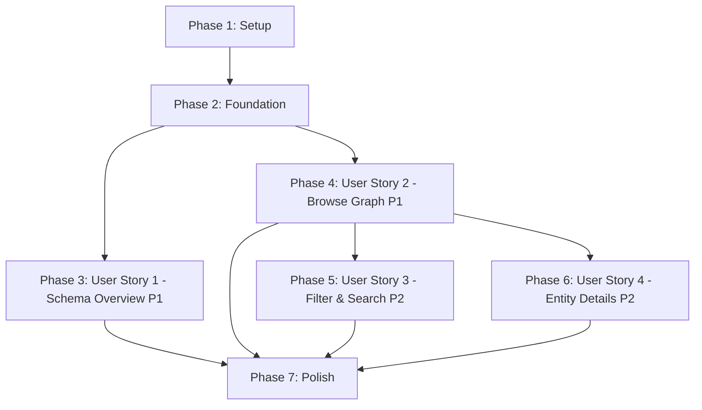

# Tasks: Graph Explorer

**Feature**: 002-graph-explorer
**Input**: Design documents from `/specs/002-graph-explorer/`
**Prerequisites**: plan.md ✅, spec.md ✅, research.md ✅, data-model.md ✅, contracts/ ✅

**Tests**: Contract tests and integration tests included per TDD approach (Constitution Principle III)

**Organization**: Tasks are grouped by user story to enable independent implementation and testing of each story.

## Format: `[ID] [P?] [Story] Description`

- **[P]**: Can run in parallel (different files, no dependencies)
- **[Story]**: Which user story this task belongs to (e.g., US1, US2, US3)
- Include exact file paths in descriptions

---

## Phase 1: Setup (Shared Infrastructure)

**Purpose**: Wails project initialization and basic structure

- [X] T001 Initialize Wails project structure using `wails init -n explorer -t react-ts`
- [X] T002 Adapt Wails template to monorepo structure (move to cmd/explorer/ and frontend/)
- [X] T003 [P] Install frontend dependencies: react-force-graph, three, @types/three in frontend/package.json
- [X] T004 [P] Configure Wails build in wails.json to reference frontend/ directory
- [X] T005 [P] Create internal/explorer package directory structure
- [X] T006 [P] Add frontend/dist to .gitignore
- [X] T007 Verify Wails dev server starts with `wails dev` from cmd/explorer/

---

## Phase 2: Foundational (Blocking Prerequisites)

**Purpose**: Core infrastructure that MUST be complete before ANY user story can be implemented

**⚠️ CRITICAL**: No user story work can begin until this phase is complete

- [X] T008 Create shared DTO models in internal/explorer/models.go (GraphNode, GraphEdge, SchemaType, PropertyDefinition)
- [X] T009 Create GraphResponse and RelationshipsResponse types in internal/explorer/models.go
- [X] T010 Create SchemaResponse type in internal/explorer/models.go
- [X] T011 Create NodeFilter type in internal/explorer/models.go
- [X] T012 Setup database connection helper in cmd/explorer/main.go using existing ent client
- [X] T013 Create test fixtures directory structure tests/contract/ and tests/integration/explorer/
- [X] T014 Setup test database configuration and helper functions for contract tests in tests/contract/test_helper.go
- [X] T015 Generate TypeScript types from Go models using `wails generate module` in frontend/

**Checkpoint**: Foundation ready - user story implementation can now begin in parallel

---

## Phase 3: User Story 1 - View Schema Overview (Priority: P1) 🎯 MVP

**Goal**: Display both promoted schema types (Email, Relationship, etc.) and dynamically discovered entities with their properties, counts, and sample values

**Independent Test**: Open the explorer, view the schema panel, verify that both promoted types and discovered entity types are displayed with their properties and counts. Click on a type to see detailed information. Refresh to see updated schema.

### Contract Tests for User Story 1

> **NOTE: Write these tests FIRST, ensure they FAIL before implementation**

- [X] T016 [P] [US1] Contract test: SchemaService.GetSchema returns promoted types in tests/contract/schema_service_contract_test.go
- [X] T017 [P] [US1] Contract test: SchemaService.GetSchema returns discovered types in tests/contract/schema_service_contract_test.go
- [X] T018 [P] [US1] Contract test: SchemaService.GetSchema has no overlap between categories in tests/contract/schema_service_contract_test.go
- [X] T019 [P] [US1] Contract test: SchemaService.GetSchema includes property metadata in tests/contract/schema_service_contract_test.go
- [X] T020 [P] [US1] Contract test: SchemaService.GetTypeDetails returns type details in tests/contract/schema_service_contract_test.go
- [X] T021 [P] [US1] Contract test: SchemaService.RefreshSchema updates schema in tests/contract/schema_service_contract_test.go

### Backend Implementation for User Story 1

- [X] T022 [US1] Implement SchemaService interface in internal/explorer/schema_service.go
- [X] T023 [US1] Implement GetSchema() method using ent schema introspection for promoted types in internal/explorer/schema_service.go
- [X] T024 [US1] Implement GetSchema() method: query DiscoveredEntity table grouped by type in internal/explorer/schema_service.go
- [X] T025 [US1] Implement GetSchema() method: extract property definitions from JSONB using jsonb_object_keys in internal/explorer/schema_service.go
- [X] T026 [US1] Implement GetSchema() method: query sample values for each type in internal/explorer/schema_service.go
- [X] T027 [US1] Implement GetTypeDetails() method in internal/explorer/schema_service.go
- [X] T028 [US1] Implement RefreshSchema() method (clears cache, re-queries) in internal/explorer/schema_service.go
- [X] T029 [US1] Add SchemaService to Wails app binding in cmd/explorer/main.go
- [X] T030 [US1] Verify all contract tests pass for SchemaService

### Frontend Implementation for User Story 1

- [X] T031 [P] [US1] Create TypeScript types in frontend/src/types/graph.ts (SchemaResponse, SchemaType, PropertyDefinition)
- [X] T032 [P] [US1] Create Wails API bindings in frontend/src/services/wails.ts
- [X] T033 [US1] Implement SchemaPanel component in frontend/src/components/SchemaPanel.tsx (promoted types section)
- [X] T034 [US1] Implement SchemaPanel component: discovered types section in frontend/src/components/SchemaPanel.tsx
- [X] T035 [US1] Implement SchemaPanel component: type click handler to show details in frontend/src/components/SchemaPanel.tsx
- [X] T036 [US1] Implement SchemaPanel component: refresh button handler in frontend/src/components/SchemaPanel.tsx
- [X] T037 [US1] Add visual differentiation (icons/colors) for promoted vs discovered types in frontend/src/components/SchemaPanel.tsx
- [X] T038 [US1] Integrate SchemaPanel into App.tsx with GetSchema() call on mount
- [X] T039 [US1] Add loading state and error handling for schema fetch in frontend/src/App.tsx

### Integration Tests for User Story 1

- [ ] T040 [US1] Integration test: Full flow from Wails app start to schema display in tests/integration/explorer/schema_explorer_test.go
- [ ] T041 [US1] Integration test: Type click shows details in tests/integration/explorer/schema_explorer_test.go
- [ ] T042 [US1] Integration test: Refresh updates schema in tests/integration/explorer/schema_explorer_test.go

**Checkpoint**: At this point, User Story 1 should be fully functional - users can view promoted types, discovered types, click for details, and refresh schema

---

## Phase 4: User Story 2 - Browse Graph Visually (Priority: P1) 🎯 MVP

**Goal**: Provide interactive graphical visualization of the graph structure with force-directed layout, auto-loading 50-100 nodes on startup, pan/zoom, node click for details, and batch-loaded relationship expansion

**Independent Test**: Open the explorer, see 50-100 random nodes auto-loaded with force-directed layout. Pan/zoom the graph. Click a node to see its properties. Expand a node to see its connected nodes. For nodes with >50 relationships, verify batched loading with "Load 50 more" button.

### Contract Tests for User Story 2

> **NOTE: Write these tests FIRST, ensure they FAIL before implementation**

- [ ] T043 [P] [US2] Contract test: GraphService.GetRandomNodes returns limited nodes in tests/contract/graph_service_contract_test.go
- [ ] T044 [P] [US2] Contract test: GraphService.GetRandomNodes validates node fields in tests/contract/graph_service_contract_test.go
- [ ] T045 [P] [US2] Contract test: GraphService.GetRandomNodes edges reference returned nodes in tests/contract/graph_service_contract_test.go
- [ ] T046 [P] [US2] Contract test: GraphService.GetRelationships paginates correctly in tests/contract/graph_service_contract_test.go
- [ ] T047 [P] [US2] Contract test: GraphService.GetRelationships handles final batch in tests/contract/graph_service_contract_test.go
- [ ] T048 [P] [US2] Contract test: GraphService.GetNodeDetails returns complete info in tests/contract/graph_service_contract_test.go

### Backend Implementation for User Story 2

- [ ] T049 [US2] Implement GraphService interface in internal/explorer/graph_service.go
- [ ] T050 [US2] Implement GetRandomNodes() method: query exactly 100 random nodes from all entity types in internal/explorer/graph_service.go
- [ ] T051 [US2] Implement GetRandomNodes() method: include connecting edges in response in internal/explorer/graph_service.go
- [ ] T052 [US2] Implement GetRelationships() method: paginated query with OFFSET/LIMIT in internal/explorer/graph_service.go
- [ ] T053 [US2] Implement GetRelationships() method: count total relationships for has_more flag in internal/explorer/graph_service.go
- [ ] T054 [US2] Implement GetRelationships() method: return connected nodes in internal/explorer/graph_service.go
- [ ] T055 [US2] Implement GetNodeDetails() method in internal/explorer/graph_service.go
- [ ] T056 [US2] Add GraphService to Wails app binding in cmd/explorer/main.go
- [ ] T057 [US2] Verify all contract tests pass for GraphService

### Frontend Implementation for User Story 2

- [ ] T058 [P] [US2] Create GraphData and GraphNodeWithPosition types in frontend/src/types/graph.ts
- [ ] T059 [P] [US2] Create ExpandedNodeState type for batch tracking in frontend/src/types/graph.ts
- [ ] T060 [US2] Implement GraphCanvas component in frontend/src/components/GraphCanvas.tsx (force-directed layout with react-force-graph)
- [ ] T061 [US2] Configure react-force-graph with directional arrows (linkDirectionalArrowLength) in frontend/src/components/GraphCanvas.tsx
- [ ] T062 [US2] Implement node color/shape differentiation by entity type in frontend/src/components/GraphCanvas.tsx
- [ ] T063 [US2] Implement pan and zoom controls in frontend/src/components/GraphCanvas.tsx
- [ ] T064 [US2] Implement node click handler to show details in frontend/src/components/GraphCanvas.tsx
- [ ] T065 [US2] Implement node right-click handler to expand relationships in frontend/src/components/GraphCanvas.tsx
- [ ] T065a [US2] Implement relationship count indicators on newly loaded nodes (FR-006b) in frontend/src/components/GraphCanvas.tsx
- [ ] T065b [US2] Ensure newly loaded nodes do NOT auto-expand (require explicit click per FR-006b) in frontend/src/components/GraphCanvas.tsx
- [ ] T066 [US2] Implement LoadMoreButton component for batched relationship loading in frontend/src/components/LoadMoreButton.tsx
- [ ] T067 [US2] Integrate GraphCanvas into App.tsx with GetRandomNodes(100) call in useEffect hook on mount (empty dependency array) in frontend/src/App.tsx
- [ ] T068 [US2] Add state management for expandedNodes tracking in frontend/src/App.tsx
- [ ] T069 [US2] Implement batch loading logic: call GetRelationships() with offset in frontend/src/App.tsx
- [ ] T070 [US2] Implement DetailPanel component to show selected node properties in frontend/src/components/DetailPanel.tsx
- [ ] T071 [US2] Add loading state and error handling for graph operations in frontend/src/App.tsx

### Integration Tests for User Story 2

- [ ] T072 [US2] Integration test: Auto-load 50-100 nodes on startup in tests/integration/explorer/graph_explorer_test.go
- [ ] T073 [US2] Integration test: Node click shows details panel in tests/integration/explorer/graph_explorer_test.go
- [ ] T074 [US2] Integration test: Expand node loads relationships in tests/integration/explorer/graph_explorer_test.go
- [ ] T075 [US2] Integration test: Batched loading for high-degree nodes in tests/integration/explorer/graph_explorer_test.go

**Checkpoint**: At this point, User Story 2 should be fully functional - users can browse the graph visually with force-directed layout, pan/zoom, click nodes, and expand relationships with batching

---

## Phase 5: User Story 3 - Filter and Search Graph Data (Priority: P2)

**Goal**: Enable users to filter displayed entities by type, category (promoted/discovered), and search by property values to focus on relevant data subsets

**Independent Test**: Apply filter to show only Email entities, verify graph updates. Search for specific property value, verify matching entities highlighted. Clear filters, verify full graph restored. Filter by promoted vs discovered entities.

### Contract Tests for User Story 3

> **NOTE: Write these tests FIRST, ensure they FAIL before implementation**

- [ ] T076 [P] [US3] Contract test: GraphService.GetNodes filters by type in tests/contract/graph_service_contract_test.go
- [ ] T077 [P] [US3] Contract test: GraphService.GetNodes filters by category in tests/contract/graph_service_contract_test.go
- [ ] T078 [P] [US3] Contract test: GraphService.GetNodes searches by property value in tests/contract/graph_service_contract_test.go
- [ ] T079 [P] [US3] Contract test: GraphService.GetNodes combines multiple filters in tests/contract/graph_service_contract_test.go

### Backend Implementation for User Story 3

- [ ] T080 [US3] Implement GetNodes() method with type filtering in internal/explorer/graph_service.go
- [ ] T080a [US3] Implement GetNodes() to include edges to nodes outside filter (FR-007a) in internal/explorer/graph_service.go
- [ ] T080b [US3] Mark unmatched target nodes as ghost placeholders (is_ghost=true per FR-007a) in internal/explorer/graph_service.go
- [ ] T081 [US3] Implement GetNodes() method with category filtering in internal/explorer/graph_service.go
- [ ] T082 [US3] Implement GetNodes() method with search query (case-insensitive property matching) in internal/explorer/graph_service.go
- [ ] T083 [US3] Implement GetNodes() method with limit parameter in internal/explorer/graph_service.go
- [ ] T084 [US3] Verify contract tests pass for GetNodes filtering

### Frontend Implementation for User Story 3

- [ ] T085 [P] [US3] Create NodeFilter type in frontend/src/types/graph.ts
- [ ] T086 [US3] Implement FilterBar component in frontend/src/components/FilterBar.tsx (type selector)
- [ ] T087 [US3] Implement FilterBar component: category filter (promoted/discovered/all) in frontend/src/components/FilterBar.tsx
- [ ] T088 [US3] Implement FilterBar component: search input field in frontend/src/components/FilterBar.tsx
- [ ] T089 [US3] Implement FilterBar component: clear filters button in frontend/src/components/FilterBar.tsx
- [ ] T090 [US3] Integrate FilterBar into App.tsx with filter state management in frontend/src/App.tsx
- [ ] T091 [US3] Implement filter application logic: call GetNodes() with NodeFilter in frontend/src/App.tsx
- [ ] T091a [US3] Render ghost nodes with distinct visual style (greyed out, semi-transparent per FR-007a) in frontend/src/components/GraphCanvas.tsx
- [ ] T092 [US3] Update GraphCanvas to highlight search results using node color change (distinct highlight color) and auto-zoom to center results in frontend/src/components/GraphCanvas.tsx

### Integration Tests for User Story 3

- [ ] T093 [US3] Integration test: Filter by entity type updates graph in tests/integration/explorer/filter_test.go
- [ ] T094 [US3] Integration test: Search by property value highlights matches in tests/integration/explorer/filter_test.go
- [ ] T095 [US3] Integration test: Clear filters restores full graph in tests/integration/explorer/filter_test.go

**Checkpoint**: At this point, User Story 3 should be fully functional - users can filter by type, category, search by property values, and clear filters

---

## Phase 6: User Story 4 - Navigate Entity Details (Priority: P2)

**Goal**: Provide detailed information panel for selected entities showing all properties, metadata, and related entities

**Independent Test**: Select any node in the graph, verify detail panel shows all properties. Check that entities with relationships show connected entity list. For discovered entities, verify metadata (discovery timestamp, confidence) is displayed.

### Frontend Implementation for User Story 4

> Note: Backend already implemented in US2 (GetNodeDetails). This phase focuses on enhanced UI.

- [ ] T096 [P] [US4] Enhance DetailPanel component with property list view in frontend/src/components/DetailPanel.tsx
- [ ] T097 [P] [US4] Enhance DetailPanel component with metadata section (timestamps, category) in frontend/src/components/DetailPanel.tsx
- [ ] T098 [US4] Add related entities list to DetailPanel in frontend/src/components/DetailPanel.tsx
- [ ] T099 [US4] Implement null/missing value display logic in DetailPanel in frontend/src/components/DetailPanel.tsx
- [ ] T100 [US4] Add expand button for each relationship in detail panel in frontend/src/components/DetailPanel.tsx
- [ ] T101 [US4] Style DetailPanel for readability (collapsible sections, copy buttons) in frontend/src/components/DetailPanel.tsx

### Integration Tests for User Story 4

- [ ] T102 [US4] Integration test: Detail panel shows all properties for selected node in tests/integration/explorer/detail_test.go
- [ ] T103 [US4] Integration test: Detail panel shows related entities list in tests/integration/explorer/detail_test.go
- [ ] T104 [US4] Integration test: Discovered entity shows metadata in tests/integration/explorer/detail_test.go

**Checkpoint**: At this point, User Story 4 should be fully functional - users can view comprehensive entity details with properties, metadata, and related entities

---

## Phase 7: Polish & Cross-Cutting Concerns

**Purpose**: Performance optimization, error handling, documentation, and final integration

- [ ] T105 [P] Optimize force-graph rendering performance for 1000+ nodes (verify SC-008: <500ms pan/zoom) in frontend/src/components/GraphCanvas.tsx
- [ ] T106 [P] Add comprehensive error boundaries for React components in frontend/src/App.tsx
- [ ] T107 [P] Implement loading skeletons for schema and graph panels in frontend/src/components/
- [ ] T108 [P] Add tooltips for UI controls and graph nodes in frontend/src/components/
- [ ] T109 [P] Implement keyboard shortcuts (Escape to clear selection, Space to recenter) in frontend/src/App.tsx
- [ ] T110 [P] Add accessibility labels (ARIA) to interactive elements in frontend/src/components/
- [ ] T111 Verify success criteria SC-001: schema loads in <2 seconds
- [ ] T112 Verify success criteria SC-002: navigate 100-500 nodes smoothly
- [ ] T113 Verify success criteria SC-003: node details appear in <1 second
- [ ] T114 Verify success criteria SC-004: filters update in <1 second
- [ ] T115 Verify success criteria SC-005: promoted vs discovered visually distinct
- [ ] T116 Verify success criteria SC-006: node expansion in <2 seconds
- [ ] T117 Verify success criteria SC-007: exploration task in <5 minutes first use
- [ ] T118 Verify success criteria SC-008: 1000 nodes pan/zoom in <500ms
- [ ] T119 [P] Create user documentation in README.md for Graph Explorer
- [ ] T120 [P] Document build and deployment process in specs/002-graph-explorer/deployment.md
- [ ] T121 Run full test suite and verify all tests pass
- [ ] T122 Build production binary with `wails build` and test on target platforms

---

## Implementation Strategy

### MVP Scope (Recommended First Delivery)

Focus on **User Story 1 (Schema Overview)** and **User Story 2 (Browse Graph Visually)** as the MVP:
- Phase 1: Setup
- Phase 2: Foundational
- Phase 3: User Story 1 (P1) - Schema Overview
- Phase 4: User Story 2 (P1) - Browse Graph Visually

This delivers the core value: users can understand the data model and visually explore the graph.

### Incremental Delivery

After MVP, deliver remaining user stories independently:
- **User Story 3 (P2)** - Filtering and search enhances exploration
- **User Story 4 (P2)** - Detailed entity inspection completes the feature

Each user story can be delivered as a standalone release.

---

## Dependencies (User Story Completion Order)

**Key Independence**:
- User Story 1 and User Story 2 can be developed in parallel after Foundation phase
- User Story 3 and User Story 4 depend on User Story 2 but can be developed in parallel with each other
- All user stories are independently testable

---

## Parallel Execution Opportunities

### During Foundation Phase (Phase 2)

These tasks can run in parallel once setup is complete:
- T008-T011 (DTO models) - same file, sequential
- T012 (database connection) - depends on T008-T011
- T013-T014 (test setup) - parallel with T008-T012

### During User Story 1 (Phase 3)

Contract tests (T016-T021) - all parallel (different test cases)
Frontend tasks (T031-T032) - parallel with backend implementation (T022-T030)

### During User Story 2 (Phase 4)

Contract tests (T043-T048) - all parallel
Frontend tasks (T058-T059, T060-T071) - many can run in parallel with backend (T049-T057)

### During User Story 3 (Phase 5)

Contract tests (T076-T079) - all parallel
Frontend tasks (T085-T092) - parallel with backend (T080-T084)

### During Polish (Phase 7)

Tasks T105-T110, T119-T120 - all parallel (different files)
Success criteria verification (T111-T118) - sequential (dependencies on prior features)

---

## Task Summary

**Total Tasks**: 127

**By Phase**:
- Phase 1 (Setup): 7 tasks
- Phase 2 (Foundation): 8 tasks
- Phase 3 (User Story 1 - P1): 27 tasks (6 contract tests, 9 backend, 9 frontend, 3 integration tests)
- Phase 4 (User Story 2 - P1): 35 tasks (6 contract tests, 9 backend, 16 frontend, 4 integration tests)
- Phase 5 (User Story 3 - P2): 23 tasks (4 contract tests, 8 backend, 8 frontend, 3 integration tests)
- Phase 6 (User Story 4 - P2): 9 tasks (0 contract tests, 6 frontend, 3 integration tests)
- Phase 7 (Polish): 18 tasks

**By User Story**:
- User Story 1: 27 tasks
- User Story 2: 35 tasks (includes FR-006b: no auto-expand, relationship count indicators)
- User Story 3: 23 tasks (includes FR-007a: ghost nodes for cross-type relationships)
- User Story 4: 9 tasks
- Infrastructure (Setup + Foundation + Polish): 33 tasks

**Parallelizable Tasks**: 48 tasks marked with [P] (39% of total)

**Independent Test Criteria Verified**:
- ✅ User Story 1: Can test schema viewing independently
- ✅ User Story 2: Can test graph browsing independently
- ✅ User Story 3: Can test filtering independently (depends on US2 for graph data)
- ✅ User Story 4: Can test detail panel independently (depends on US2 for node selection)

**MVP Scope**: User Story 1 + User Story 2 = 62 tasks (49% of total)

---

## Format Validation

✅ All tasks follow checklist format: `- [ ] [TaskID] [P?] [Story?] Description`
✅ All task IDs are sequential (T001-T122)
✅ All user story tasks include [US1], [US2], [US3], or [US4] labels
✅ Setup and Foundation tasks have no story labels
✅ All tasks include specific file paths
✅ Parallelizable tasks marked with [P]
